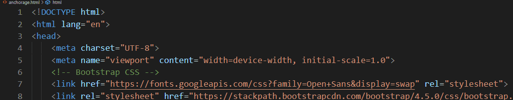
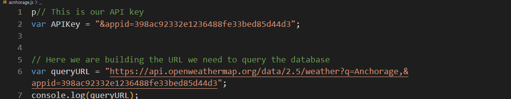

#API Bonus Work
##This is API Bonus work assginmentp

*First we retrieved an API Key from the Weather App Website after Registration
*Next we used the API Key as a variable 
*Then we built the URl to Query the data base
*Console. log to check
*Next we used Ajax to call the weather api, which turned the information into an object, queried the URL using the "get" method
*Next we stored the data in an obect called "Response"
Next we converted the temperature th Fahreneight and added the content to HTML
 We console.logged to ensure proper function

 
 